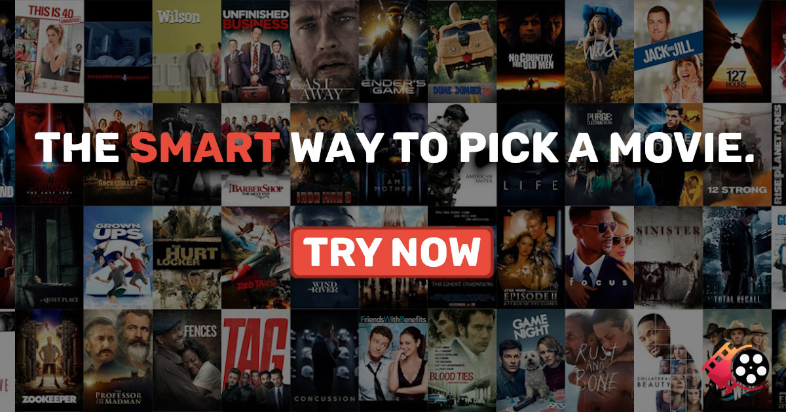

# ScreenGenius-Smart-Movie-Suggestions

## Table of Contents

* [Introduction](#Introduction)
* [Problem Statement](#Problem-Statement)
* [Business Understanding](#Business-Understanding)
* [Data Understanding](#Data-Understanding)
* [Import Necessary Libraries](#Import-Necessary-Libraries)
* [Load Dataset](#Load-Dataset)
* [Data Processing](#Data-Processing)
* [Modelling](#Modelling)
* [Evaluation](#Evaluation)
* [Prediction](#Prediction)
* [Recommnedations](#Recommnedations)

## Introduction

### Project Significance

In today's digital age, recommendation systems play a crucial role in enhancing user experiences across various platforms. They are widely used in e-commerce, content streaming, and more, helping users discover products, movies, music, and other content that align with their preferences. This project focuses on building a recommendation system for movies, leveraging the MovieLens dataset, to provide users with personalized movie recommendations.

### The MovieLens Dataset

The [MovieLens](http://movielens.org/) dataset is a well-known resource in the field of recommendation systems. It contains a vast collection of movie ratings and user interactions, making it an ideal choice for building a movie recommendation system. This dataset includes user ratings, movie information, and user demographic data.

### Project Objective

The primary objective of this project is to develop a movie recommendation system that can provide users with tailored movie suggestions based on their viewing history and preferences. By utilizing various recommendation techniques, including collaborative filtering and deep learning, we aim to enhance the user experience and increase user engagement on the platform.

### Key Challenges

Building an effective recommendation system comes with its challenges, such as handling large-scale data, addressing cold start problems for new users and movies, and choosing the most suitable recommendation algorithms. We will explore these challenges and implement solutions to create a robust system.

### Expected Outcomes

The expected outcomes of this project include:

- A functional movie recommendation system capable of providing personalized movie suggestions.
- Improved user engagement and satisfaction through tailored movie recommendations.
- Insights into the effectiveness of different recommendation techniques and their impact on user interactions.
- Potential for future enhancements and optimization of the recommendation system.

### Project Scope

This project will focus on building and evaluating movie recommendation models. We will not delve into the deployment of the system in production environments. However, we will provide insights and recommendations on how to transition from a development environment to a production-ready system.

### Audience

This project is intended for data scientists, machine learning practitioners, and developers interested in recommendation systems and personalization algorithms. It serves as a practical example of building a movie recommendation system using real-world data.

### Structure of the Report

The report is organized into several sections, each covering a specific aspect of the project, including data exploration, data processing, modeling, evaluation, and recommendations. Readers can navigate through the report to gain insights into the project's development and outcomes.

## Key Features

### 1. Personalized Movie Recommendations

- The system offers personalized movie recommendations based on user preferences and viewing history, enhancing the user experience by suggesting movies they are likely to enjoy.

### 2. Multiple Recommendation Techniques

- Utilizes various recommendation techniques, including collaborative filtering, deep learning matrix factorization, and memory-based collaborative filtering, to provide diverse and accurate movie suggestions.

### 3. User-Friendly Interface

- Integrates with a user-friendly interface that allows users to easily explore recommended movies and discover new content.

### 4. Scalable Architecture

- The recommendation system is designed with scalability in mind, ensuring it can handle large datasets and a growing user base effectively.

### 5. Data Visualization

- Provides visualizations of movie ratings and genre distributions to offer insights into user preferences and interactions.

### 6. Evaluation Metrics

- Implements evaluation metrics such as Mean Absolute Error (MAE) and Root Mean Square Error (RMSE) to assess the performance of recommendation models.

### 7. Flexibility and Extensibility

- Offers flexibility to experiment with different recommendation algorithms and expand the system's capabilities by incorporating new features and data sources.

### 8. Project Documentation

- Thorough project documentation and a well-structured README guide users and developers through the project's objectives, data sources, and implementation details.

### 9. Recommendations for Deployment

- Provides recommendations and insights for transitioning the recommendation system from development to a production-ready environment.

### 10. Insights and Analytics

- Gains valuable insights into user behavior, movie popularity, and the effectiveness of different recommendation algorithms, helping stakeholders make data-driven decisions.

## Getting Started

To set up this project locally, follow these steps:

### Prerequisites

Before you begin, make sure you have the following prerequisites installed:

- Python 3.7 or higher
- TensorFlow 2.0 or higher
- Keras 2.4 or higher
- Pandas 1.0 or higher
- Matplotlib 3.0 or higher
- Scikit-learn 0.22 or higher
- Jupyter Notebook (optional, for running notebooks)

## Accesing this Repository

1. Clone the repository to your local machine:
      ```bash
   `https://github.com/Dudimath/ScreenGenius-Smart-Movie-Suggestions.git`
   cd yourproject
2. Contributing
If you'd like to contribute to this project, please follow these steps:

Fork the repository.

Create a new branch for your feature or bug fix: `git checkout -b feature-name`

Commit your changes: `git commit -m 'Add feature'`

Push to the branch: `git push origin feature-name`

Submit a pull request with a clear description of your changes.

We welcome contributions and appreciate your help in making this project better👌👌👌

## Acknowledgement:

I would like to give credit to the GroupLens research lab at the University of Minnesota for providing the MovieLens dataset that was used in the development of this recommendation system. The MovieLens dataset is an excellent resource for building and evaluating movie recommendation algorithms.

Link to the MovieLens dataset: [MovieLens dataset](http://movielens.org/)

I am thankful for their efforts in collecting and maintaining this dataset, which has been helpful in the development and testing of the recommendation system.


